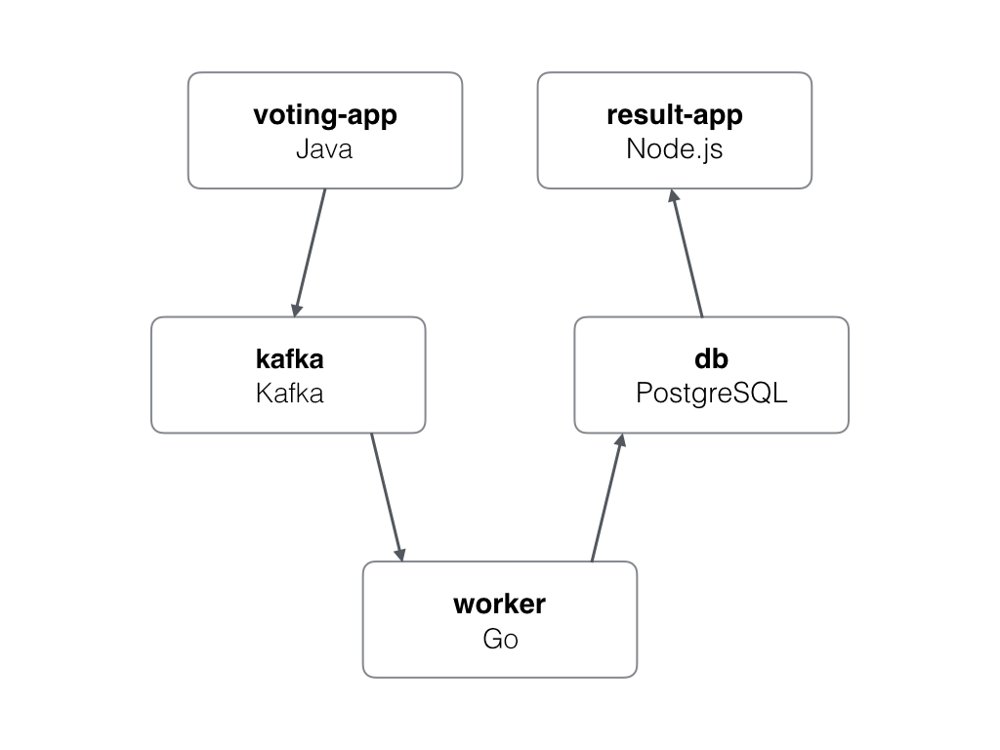

# Microservices Demo

A demo application with Java, Go, Javascript, Kafka and PostgresQL.

## Architecture



* A front-end web app in [Java](/vote) which lets you vote between Tacos and Burritos
* A [Kafka](https://bitnami.com/stack/kafka/helm) queue which collects new votes
* A [Golang](/worker) or worker which consumes votes from Kafka and stores them in PostgresQL
* A [PostgresQL](https://bitnami.com/stack/postgresql/helm) database
* A [Node.js](/result) webapp which shows the results of the voting in real time


## How to develop on hybrid mode?

Hybrid development is very interesting when we need to develop in a realistic 
environment without being able to deploy some services in the cluster either 
for security or cluster limitations.
First of all we are going to clone this repo and login into okteto cloud

```
$ git clone https://github.com/okteto/microservices-demo-compose
$ cd microservices-demo-compose
$ okteto ctx
```

### Run some services on local via docker compose

Let's create some services locally from docker compose. We'll use the detached 
mode on docker compose flag and partial deployment feature from them

```
$ docker compose up -d worker postgresql zookeeper kafka 
```


## Develop on Okteto cloud

okteto will ignore all services that have the label `dev.okteto.com/runtime: docker` so it will deploy and put in development mode those that do not.

```
$ okteto up --detach
```

It will create a tunnel from local to the cluster for all the exposed ports of the services with the above
 proposed label and another tunnel from the cluster to local with the services deployed in the cluster, 
 allowing access from both localhost and the endpoint provided by okteto.

## Notes

The voting application only accepts one vote per client. It does not register votes if a vote has already been submitted from a client.

This isn't an example of a properly architected perfectly designed distributed app... it's just a simple
example of the various types of pieces and languages you might see (queues, persistent data, etc), and how to
deal with them in Okteto.
